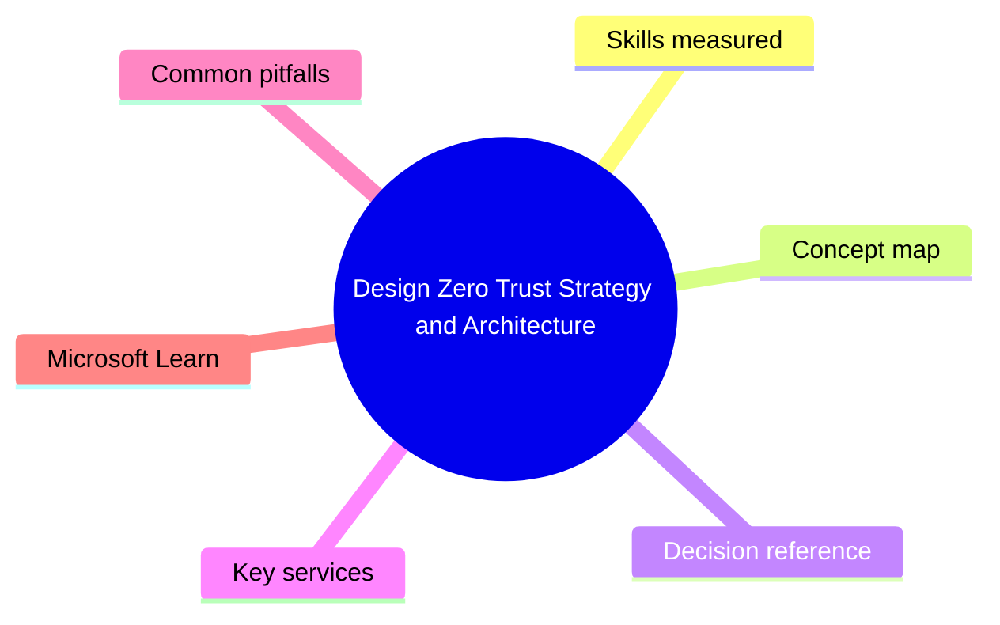
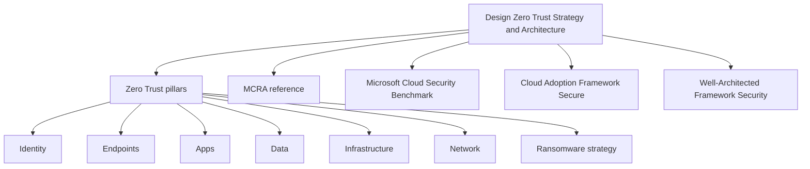

# Design Zero Trust Strategy and Architecture

> Domain 1 of SC-100. Weight: 32%.

## Domain mind map

## Skills measured

- Build an overall security strategy and architecture aligned to Zero Trust
- Translate business goals into Zero Trust pillar requirements (identity, endpoints, apps, data, infra, network)
- Design a security operations strategy (people, process, technology)
- Design an identity security strategy (Entra ID, hybrid, B2B/B2C)
- Recommend a strategy for ransomware protection and recovery
- Recommend a strategy for managing technical debt and legacy/insecure protocols

## Concept map

## Decision reference

| When you see... | Pick... | Why |
|---|---|---|
| Customer asks for end-to-end ZT plan | Use MCRA + Zero Trust deployment guide as the spine | Map each pillar to MS products, then sequence by risk |
| Need a security baseline for Azure | Microsoft Cloud Security Benchmark (MCSB) | Ships as Defender for Cloud built-in policy initiative |
| Architect a brand-new Azure landing zone | CAF Secure methodology + Enterprise-Scale landing zone | Includes mgmt groups, policy, identity |
| Ransomware playbook ask | 3-phase: prepare (immutable backup, PIM), limit blast radius (tier 0 isolation, segmentation), recover (clean-room rebuild) | Map to Microsoft ransomware guidance |
| Lots of legacy SMBv1/NTLM in environment | Phased deprecation with compensating controls (SMB signing, network isolation, EDR) | Cannot remove overnight - reduce blast radius first |

## Key services

- **Microsoft Cybersecurity Reference Architectures (MCRA)** - Visual reference of all MS security tech mapped to Zero Trust
- **Microsoft Cloud Security Benchmark (MCSB)** - Prescriptive controls superseding Azure Security Benchmark; multi-cloud
- **Cloud Adoption Framework - Secure methodology** - Outcome-based framework for security in cloud journeys
- **Well-Architected Framework - Security pillar** - Architectural design principles + checklist
- **Enterprise-Scale landing zone** - Reference IaC (Bicep/Terraform) for hub-spoke + identity + policy

## Common pitfalls

- Treating Zero Trust as a product purchase instead of an iterative architecture practice
- Skipping the business-outcomes mapping and jumping straight to tools
- Over-investing in network controls and ignoring identity (identity is the new perimeter)
- Forgetting that legacy auth disablement is a phased effort - need monitoring first

## Microsoft Learn

- [SC-100 study guide](https://learn.microsoft.com/credentials/certifications/exams/sc-100/)
- [MCRA](https://learn.microsoft.com/security/cybersecurity-reference-architecture/mcra)
- [MCSB](https://learn.microsoft.com/security/benchmark/azure/)
- [CAF Secure](https://learn.microsoft.com/azure/cloud-adoption-framework/secure/)

---

[<- Master Index](00-MASTER-INDEX.md) | [Master Index](00-MASTER-INDEX.md) | [Evaluate GRC Strategies and Security Operations ->](02-grc-secops.md)
