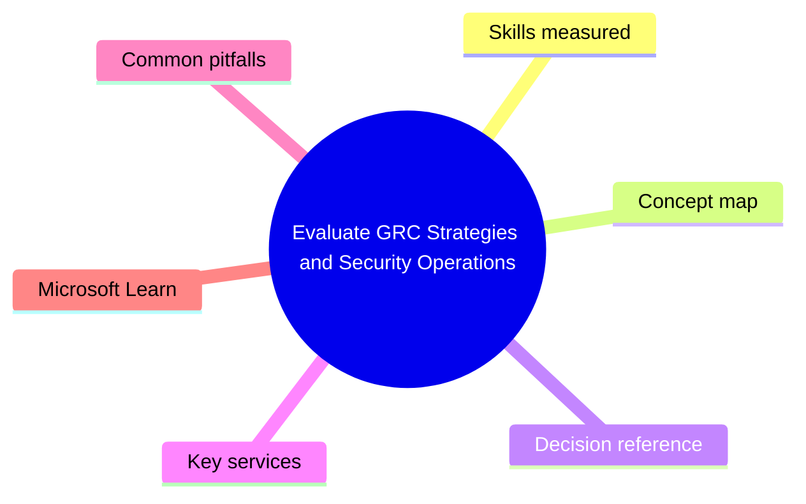
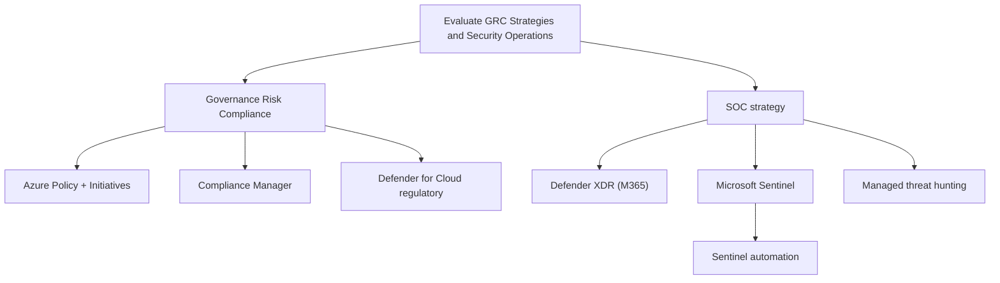

# Evaluate GRC Strategies and Security Operations

> Domain 2 of SC-100. Weight: 23%.

## Domain mind map

## Skills measured

- Specify priorities for meeting regulatory compliance (HIPAA, PCI, ISO, FedRAMP, GDPR)
- Translate compliance requirements into Azure Policy + initiatives
- Design a strategy for security operations: SIEM/SOAR/XDR placement
- Design a strategy for incident response, threat detection, and posture management
- Evaluate processes for security incidents (NIST 800-61, MS DART model)

## Concept map

## Decision reference

| When you see... | Pick... | Why |
|---|---|---|
| Multi-regulator estate (PCI + HIPAA + ISO) | Defender for Cloud Regulatory Compliance dashboard + Compliance Manager | DfC for technical, CM for org-wide |
| Custom compliance need | Azure Policy initiative + custom policies | Map requirements to denyAuditDeployIfNotExists effects |
| Single pane SOC across MS + 3rd party | Sentinel + Defender XDR connector | Unified incidents in Defender portal |
| Need 24x7 hunting expertise we lack | Microsoft Defender Experts for Hunting | Managed service - MS hunters in your tenant |
| Codify IR runbook | Sentinel playbooks (Logic Apps) + automation rules | Trigger on incident severity |

## Key services

- **Azure Policy / Initiatives** - Declarative governance with audit + enforce + remediate
- **Defender for Cloud Regulatory Compliance** - Continuous assessment against built-in standards
- **Microsoft Sentinel** - Cloud SIEM/SOAR; ingest any source
- **Defender XDR** - Native MS detections, automated investigation + response (AIR)
- **Microsoft Defender Experts** - Managed XDR / managed hunting

## Common pitfalls

- Designing two SOCs (one for cloud, one for on-prem) instead of one fused SOC
- Forgetting Sentinel cost = ingestion volume + retention - estimate before deploying
- Treating compliance dashboards as compliance achievement (still need attestation)
- Confusing Defender XDR auto-investigation with Sentinel SOAR (XDR is built-in, Sentinel is custom)

## Microsoft Learn

- [Design a strategy for security operations](https://learn.microsoft.com/training/paths/design-strategy-security-operations/)
- [Defender for Cloud regulatory compliance](https://learn.microsoft.com/azure/defender-for-cloud/regulatory-compliance-dashboard)
- [Sentinel architecture](https://learn.microsoft.com/azure/sentinel/best-practices)

---

[<- Design Zero Trust Strategy and Architecture](01-zero-trust-architecture.md) | [Master Index](00-MASTER-INDEX.md) | [Design Security for Infrastructure ->](03-infrastructure-security.md)
