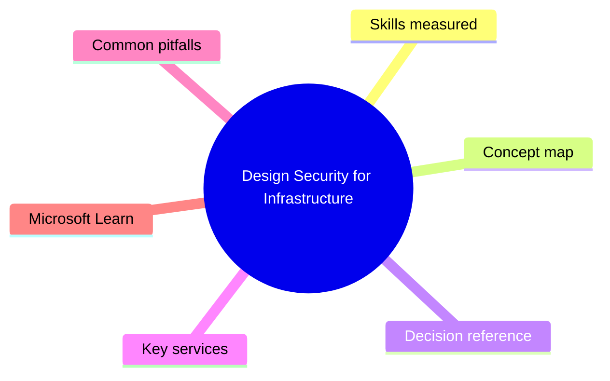
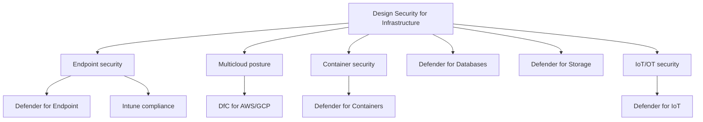

# Design Security for Infrastructure

> Domain 3 of SC-100. Weight: 23%.

## Domain mind map

## Skills measured

- Design a strategy for securing server / client endpoints (Defender for Endpoint, Intune)
- Design a strategy for securing SaaS, PaaS, and IaaS services
- Specify security baselines for Azure compute (VMs, containers, AKS)
- Recommend a strategy for securing IoT, OT (Defender for IoT)
- Design a strategy for hybrid + multicloud posture (Defender for Cloud across AWS + GCP)

## Concept map

## Decision reference

| When you see... | Pick... | Why |
|---|---|---|
| Discover non-Azure servers (on-prem, AWS, GCP) | Azure Arc + Defender for Servers Plan 2 | Arc onboards servers; DfS adds EDR (MDE), JIT, FIM |
| Container runtime threat detection | Defender for Containers | Cluster posture + runtime detections + admission control |
| OT network monitoring | Defender for IoT (network sensor) | Passive network monitoring of ICS/SCADA |
| Block PII exfil from Azure SQL | Defender for Databases + Always Encrypted + Purview classification | Layered: detect, encrypt, classify |
| AWS account posture in same dashboard as Azure | Defender for Cloud multicloud connector | Reads AWS Security Hub + adds MSCB checks |

## Key services

- **Defender for Servers (P1/P2)** - P2 includes MDE + FIM + JIT + adaptive app control
- **Defender for Containers** - AKS + ACR scanning + runtime detections
- **Defender for Databases** - SQL/Cosmos/Open-source databases threat protection
- **Defender for Storage** - Malware scanning + sensitive data discovery
- **Defender for IoT** - Agentless OT + agent-based device security
- **Azure Arc** - Onboard non-Azure servers, K8s, data services

## Common pitfalls

- Forgetting DfS Plan 1 vs Plan 2 differences (Plan 2 adds the heavyweight EDR + FIM)
- Assuming Defender for Containers covers Windows nodes - check current support matrix
- Mixing up Defender for IoT 'Enterprise IoT' vs 'OT' SKUs
- Neglecting cost of Defender for Storage with malware scanning enabled on hot blobs

## Microsoft Learn

- [Design strategy for securing infrastructure](https://learn.microsoft.com/training/paths/design-solutions-infrastructure-security/)
- [Defender for Cloud plans](https://learn.microsoft.com/azure/defender-for-cloud/defender-for-cloud-introduction)
- [Azure Arc-enabled servers](https://learn.microsoft.com/azure/azure-arc/servers/overview)

---

[<- Evaluate GRC Strategies and Security Operations](02-grc-secops.md) | [Master Index](00-MASTER-INDEX.md) | [Design Strategy for Data and Applications ->](04-data-app-security.md)
