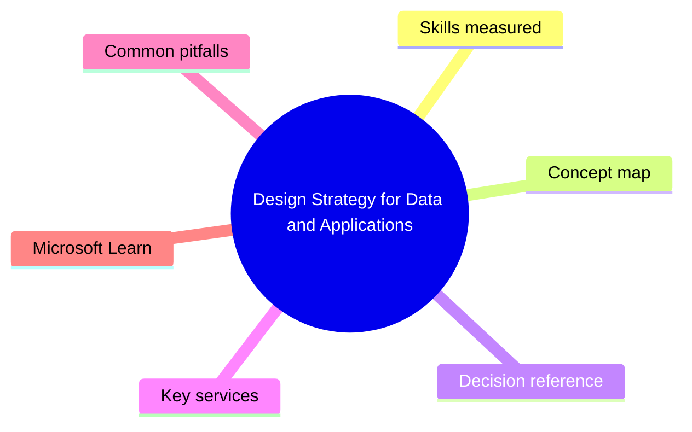
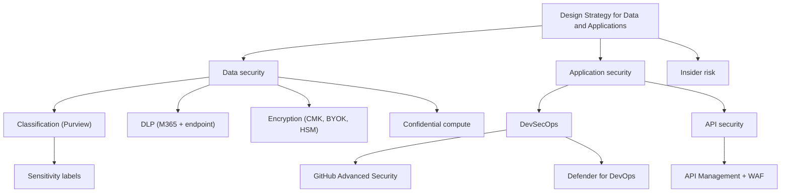

# Design Strategy for Data and Applications

> Domain 4 of SC-100. Weight: 22%.

## Domain mind map

## Skills measured

- Design a strategy for securing data at rest, in transit, in use (CMK, double encryption, confidential compute)
- Recommend a Purview-based data classification + DLP strategy
- Design a strategy for securing applications: SDL, secret management, supply chain (GitHub Advanced Security, Defender for DevOps)
- Recommend an API security strategy (API Mgmt, WAF)
- Design a strategy for protecting against insider risk + IP theft

## Concept map

## Decision reference

| When you see... | Pick... | Why |
|---|---|---|
| Need keys never to leave HSM | Key Vault Managed HSM (FIPS 140-2 Level 3) + customer-managed keys | Single-tenant HSM |
| Compute on encrypted data without decrypting in memory | Azure Confidential Computing (SGX or AMD SEV-SNP) | TEE protects data in use |
| Find secrets in source code | GitHub Advanced Security secret scanning + push protection | Pre-commit + repo scan |
| Multi-repo posture across GitHub + ADO | Defender for DevOps | Surfaces findings in DfC |
| Public API at risk of bot scraping | API Mgmt + WAF + rate limiting + Entra ID auth | Layered API protection |
| Departing exec downloads sensitive files | Insider Risk Management policy | Triggered on resignation + exfil signals |

## Key services

- **Microsoft Purview Information Protection** - Sensitivity labels + auto-labeling + double-key encryption
- **Microsoft Purview DLP** - Policies across M365 services + endpoints
- **Azure Key Vault / Managed HSM** - Secrets/keys/certs; Managed HSM = single-tenant FIPS L3
- **Azure Confidential Computing** - VMs/containers in TEEs
- **GitHub Advanced Security** - Code scanning (CodeQL) + secret scanning + dependency review
- **Microsoft Defender for DevOps** - Pipeline + posture insights in DfC
- **Azure API Management** - Gateway + policies + rate limiting

## Common pitfalls

- Using Key Vault Standard for FIPS-140-2 L3 needs (you need Premium or Managed HSM)
- Confusing CMK with BYOK - CMK = you own key in Azure; BYOK = imported key material
- Forgetting endpoint DLP requires devices onboarded to Defender for Endpoint
- Treating insider risk = DLP - they are complementary (rule-based vs behavioral)

## Microsoft Learn

- [Design strategy for securing data](https://learn.microsoft.com/training/paths/design-solutions-data-security/)
- [Design strategy for securing applications](https://learn.microsoft.com/training/paths/design-solutions-application-security/)
- [Confidential computing](https://learn.microsoft.com/azure/confidential-computing/)

---

[<- Design Security for Infrastructure](03-infrastructure-security.md) | [Master Index](00-MASTER-INDEX.md) | [Cheatsheet ->](05-exam-cheatsheet.md)
