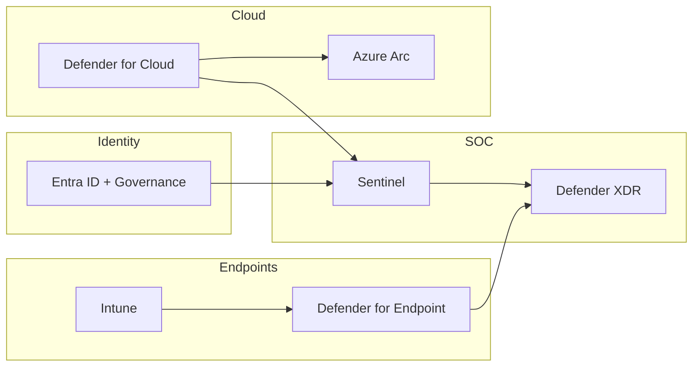
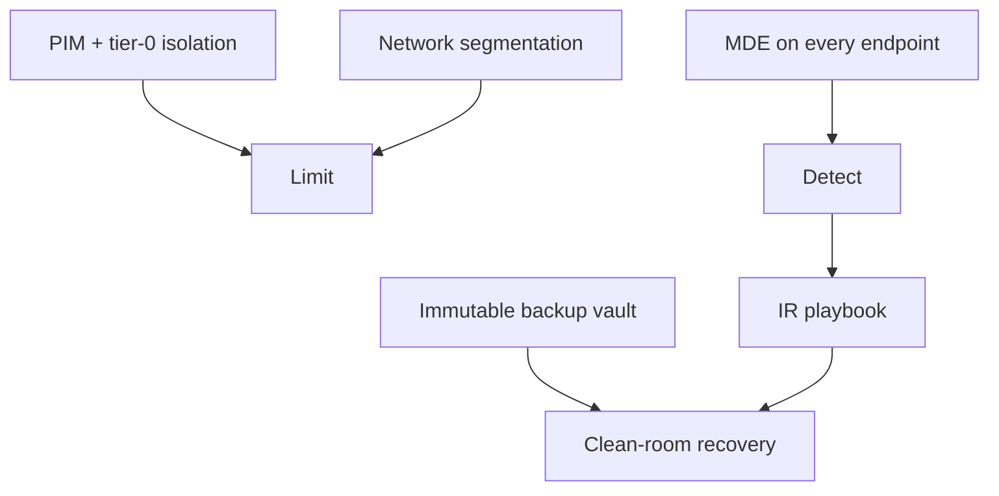

# Architectures - SC-100

> Reference architectures you should be able to draw on a whiteboard for the exam.

## MCRA-aligned target state (high-level)

## Ransomware-resilient design

---

[Master Index](00-MASTER-INDEX.md)
